# Projects and dependencies analysis

This document provides a comprehensive overview of the projects and their dependencies in the context of upgrading to .NETCoreApp,Version=v10.0.

## Table of Contents

- [Executive Summary](#executive-Summary)
  - [Highlevel Metrics](#highlevel-metrics)
  - [Projects Compatibility](#projects-compatibility)
  - [Package Compatibility](#package-compatibility)
  - [API Compatibility](#api-compatibility)
- [Aggregate NuGet packages details](#aggregate-nuget-packages-details)
- [Top API Migration Challenges](#top-api-migration-challenges)
  - [Technologies and Features](#technologies-and-features)
  - [Most Frequent API Issues](#most-frequent-api-issues)
- [Projects Relationship Graph](#projects-relationship-graph)
- [Project Details](#project-details)

  - [core\Piranha.AspNetCore.Hosting\Piranha.AspNetCore.Hosting.csproj](#corepiranhaaspnetcorehostingpiranhaaspnetcorehostingcsproj)
  - [core\Piranha.AspNetCore\Piranha.AspNetCore.csproj](#corepiranhaaspnetcorepiranhaaspnetcorecsproj)
  - [core\Piranha.AttributeBuilder\Piranha.AttributeBuilder.csproj](#corepiranhaattributebuilderpiranhaattributebuildercsproj)
  - [core\Piranha.Azure.BlobStorage\Piranha.Azure.BlobStorage.csproj](#corepiranhaazureblobstoragepiranhaazureblobstoragecsproj)
  - [core\Piranha.ImageSharp\Piranha.ImageSharp.csproj](#corepiranhaimagesharppiranhaimagesharpcsproj)
  - [core\Piranha.Local.FileStorage\Piranha.Local.FileStorage.csproj](#corepiranhalocalfilestoragepiranhalocalfilestoragecsproj)
  - [core\Piranha.Manager.LocalAuth\Piranha.Manager.LocalAuth.csproj](#corepiranhamanagerlocalauthpiranhamanagerlocalauthcsproj)
  - [core\Piranha.Manager.Localization\Piranha.Manager.Localization.csproj](#corepiranhamanagerlocalizationpiranhamanagerlocalizationcsproj)
  - [core\Piranha.Manager.TinyMCE\Piranha.Manager.TinyMCE.csproj](#corepiranhamanagertinymcepiranhamanagertinymcecsproj)
  - [core\Piranha.Manager\Piranha.Manager.csproj](#corepiranhamanagerpiranhamanagercsproj)
  - [core\Piranha.WebApi\Piranha.WebApi.csproj](#corepiranhawebapipiranhawebapicsproj)
  - [core\Piranha\Piranha.csproj](#corepiranhapiranhacsproj)
  - [data\Piranha.Data.EF.MySql\Piranha.Data.EF.MySql.csproj](#datapiranhadataefmysqlpiranhadataefmysqlcsproj)
  - [data\Piranha.Data.EF.PostgreSql\Piranha.Data.EF.PostgreSql.csproj](#datapiranhadataefpostgresqlpiranhadataefpostgresqlcsproj)
  - [data\Piranha.Data.EF.SQLite\Piranha.Data.EF.SQLite.csproj](#datapiranhadataefsqlitepiranhadataefsqlitecsproj)
  - [data\Piranha.Data.EF.SQLServer\Piranha.Data.EF.SQLServer.csproj](#datapiranhadataefsqlserverpiranhadataefsqlservercsproj)
  - [data\Piranha.Data.EF\Piranha.Data.EF.csproj](#datapiranhadataefpiranhadataefcsproj)
  - [examples\MvcWeb\MvcWeb.csproj](#examplesmvcwebmvcwebcsproj)
  - [examples\RazorWeb\RazorWeb.csproj](#examplesrazorwebrazorwebcsproj)
  - [identity\Piranha.AspNetCore.Identity.MySQL\Piranha.AspNetCore.Identity.MySQL.csproj](#identitypiranhaaspnetcoreidentitymysqlpiranhaaspnetcoreidentitymysqlcsproj)
  - [identity\Piranha.AspNetCore.Identity.PostgreSQL\Piranha.AspNetCore.Identity.PostgreSQL.csproj](#identitypiranhaaspnetcoreidentitypostgresqlpiranhaaspnetcoreidentitypostgresqlcsproj)
  - [identity\Piranha.AspNetCore.Identity.SQLite\Piranha.AspNetCore.Identity.SQLite.csproj](#identitypiranhaaspnetcoreidentitysqlitepiranhaaspnetcoreidentitysqlitecsproj)
  - [identity\Piranha.AspNetCore.Identity.SQLServer\Piranha.AspNetCore.Identity.SQLServer.csproj](#identitypiranhaaspnetcoreidentitysqlserverpiranhaaspnetcoreidentitysqlservercsproj)
  - [identity\Piranha.AspNetCore.Identity\Piranha.AspNetCore.Identity.csproj](#identitypiranhaaspnetcoreidentitypiranhaaspnetcoreidentitycsproj)
  - [test\Piranha.Manager.Tests\Piranha.Manager.Tests.csproj](#testpiranhamanagertestspiranhamanagertestscsproj)
  - [test\Piranha.Tests\Piranha.Tests.csproj](#testpiranhatestspiranhatestscsproj)


## Executive Summary

### Highlevel Metrics

| Metric | Count | Status |
| :--- | :---: | :--- |
| Total Projects | 26 | All require upgrade |
| Total NuGet Packages | 25 | 14 need upgrade |
| Total Code Files | 879 |  |
| Total Code Files with Incidents | 33 |  |
| Total Lines of Code | 170374 |  |
| Total Number of Issues | 65 |  |
| Estimated LOC to modify | 17+ | at least 0.0% of codebase |

### Projects Compatibility

| Project | Target Framework | Difficulty | Package Issues | API Issues | Est. LOC Impact | Description |
| :--- | :---: | :---: | :---: | :---: | :---: | :--- |
| [core\Piranha.AspNetCore.Hosting\Piranha.AspNetCore.Hosting.csproj](#corepiranhaaspnetcorehostingpiranhaaspnetcorehostingcsproj) | net8.0;net9.0 | 🟢 Low | 0 | 0 |  | ClassLibrary, Sdk Style = True |
| [core\Piranha.AspNetCore\Piranha.AspNetCore.csproj](#corepiranhaaspnetcorepiranhaaspnetcorecsproj) | net8.0;net9.0 | 🟢 Low | 1 | 4 | 4+ | ClassLibrary, Sdk Style = True |
| [core\Piranha.AttributeBuilder\Piranha.AttributeBuilder.csproj](#corepiranhaattributebuilderpiranhaattributebuildercsproj) | net8.0;net9.0 | 🟢 Low | 0 | 0 |  | ClassLibrary, Sdk Style = True |
| [core\Piranha.Azure.BlobStorage\Piranha.Azure.BlobStorage.csproj](#corepiranhaazureblobstoragepiranhaazureblobstoragecsproj) | net8.0;net9.0 | 🟢 Low | 0 | 8 | 8+ | ClassLibrary, Sdk Style = True |
| [core\Piranha.ImageSharp\Piranha.ImageSharp.csproj](#corepiranhaimagesharppiranhaimagesharpcsproj) | net8.0;net9.0 | 🟢 Low | 0 | 0 |  | ClassLibrary, Sdk Style = True |
| [core\Piranha.Local.FileStorage\Piranha.Local.FileStorage.csproj](#corepiranhalocalfilestoragepiranhalocalfilestoragecsproj) | net8.0;net9.0 | 🟢 Low | 0 | 0 |  | ClassLibrary, Sdk Style = True |
| [core\Piranha.Manager.LocalAuth\Piranha.Manager.LocalAuth.csproj](#corepiranhamanagerlocalauthpiranhamanagerlocalauthcsproj) | net8.0;net9.0 | 🟢 Low | 0 | 0 |  | ClassLibrary, Sdk Style = True |
| [core\Piranha.Manager.Localization\Piranha.Manager.Localization.csproj](#corepiranhamanagerlocalizationpiranhamanagerlocalizationcsproj) | net8.0;net9.0 | 🟢 Low | 1 | 0 |  | ClassLibrary, Sdk Style = True |
| [core\Piranha.Manager.TinyMCE\Piranha.Manager.TinyMCE.csproj](#corepiranhamanagertinymcepiranhamanagertinymcecsproj) | net8.0;net9.0 | 🟢 Low | 0 | 0 |  | ClassLibrary, Sdk Style = True |
| [core\Piranha.Manager\Piranha.Manager.csproj](#corepiranhamanagerpiranhamanagercsproj) | net8.0;net9.0 | 🟢 Low | 2 | 0 |  | ClassLibrary, Sdk Style = True |
| [core\Piranha.WebApi\Piranha.WebApi.csproj](#corepiranhawebapipiranhawebapicsproj) | net8.0;net9.0 | 🟢 Low | 0 | 0 |  | ClassLibrary, Sdk Style = True |
| [core\Piranha\Piranha.csproj](#corepiranhapiranhacsproj) | net8.0;net9.0 | 🟢 Low | 4 | 1 | 1+ | ClassLibrary, Sdk Style = True |
| [data\Piranha.Data.EF.MySql\Piranha.Data.EF.MySql.csproj](#datapiranhadataefmysqlpiranhadataefmysqlcsproj) | net8.0;net9.0 | 🟢 Low | 0 | 0 |  | ClassLibrary, Sdk Style = True |
| [data\Piranha.Data.EF.PostgreSql\Piranha.Data.EF.PostgreSql.csproj](#datapiranhadataefpostgresqlpiranhadataefpostgresqlcsproj) | net8.0;net9.0 | 🟢 Low | 0 | 0 |  | ClassLibrary, Sdk Style = True |
| [data\Piranha.Data.EF.SQLite\Piranha.Data.EF.SQLite.csproj](#datapiranhadataefsqlitepiranhadataefsqlitecsproj) | net8.0;net9.0 | 🟢 Low | 1 | 0 |  | ClassLibrary, Sdk Style = True |
| [data\Piranha.Data.EF.SQLServer\Piranha.Data.EF.SQLServer.csproj](#datapiranhadataefsqlserverpiranhadataefsqlservercsproj) | net8.0;net9.0 | 🟢 Low | 1 | 0 |  | ClassLibrary, Sdk Style = True |
| [data\Piranha.Data.EF\Piranha.Data.EF.csproj](#datapiranhadataefpiranhadataefcsproj) | net8.0;net9.0 | 🟢 Low | 2 | 0 |  | ClassLibrary, Sdk Style = True |
| [examples\MvcWeb\MvcWeb.csproj](#examplesmvcwebmvcwebcsproj) | net8.0;net9.0 | 🟢 Low | 0 | 0 |  | AspNetCore, Sdk Style = True |
| [examples\RazorWeb\RazorWeb.csproj](#examplesrazorwebrazorwebcsproj) | net8.0;net9.0 | 🟢 Low | 0 | 0 |  | AspNetCore, Sdk Style = True |
| [identity\Piranha.AspNetCore.Identity.MySQL\Piranha.AspNetCore.Identity.MySQL.csproj](#identitypiranhaaspnetcoreidentitymysqlpiranhaaspnetcoreidentitymysqlcsproj) | net8.0;net9.0 | 🟢 Low | 1 | 0 |  | ClassLibrary, Sdk Style = True |
| [identity\Piranha.AspNetCore.Identity.PostgreSQL\Piranha.AspNetCore.Identity.PostgreSQL.csproj](#identitypiranhaaspnetcoreidentitypostgresqlpiranhaaspnetcoreidentitypostgresqlcsproj) | net8.0;net9.0 | 🟢 Low | 1 | 0 |  | ClassLibrary, Sdk Style = True |
| [identity\Piranha.AspNetCore.Identity.SQLite\Piranha.AspNetCore.Identity.SQLite.csproj](#identitypiranhaaspnetcoreidentitysqlitepiranhaaspnetcoreidentitysqlitecsproj) | net8.0;net9.0 | 🟢 Low | 2 | 0 |  | ClassLibrary, Sdk Style = True |
| [identity\Piranha.AspNetCore.Identity.SQLServer\Piranha.AspNetCore.Identity.SQLServer.csproj](#identitypiranhaaspnetcoreidentitysqlserverpiranhaaspnetcoreidentitysqlservercsproj) | net8.0;net9.0 | 🟢 Low | 2 | 0 |  | ClassLibrary, Sdk Style = True |
| [identity\Piranha.AspNetCore.Identity\Piranha.AspNetCore.Identity.csproj](#identitypiranhaaspnetcoreidentitypiranhaaspnetcoreidentitycsproj) | net8.0;net9.0 | 🟢 Low | 2 | 4 | 4+ | ClassLibrary, Sdk Style = True |
| [test\Piranha.Manager.Tests\Piranha.Manager.Tests.csproj](#testpiranhamanagertestspiranhamanagertestscsproj) | net8.0;net9.0 | 🟢 Low | 1 | 0 |  | DotNetCoreApp, Sdk Style = True |
| [test\Piranha.Tests\Piranha.Tests.csproj](#testpiranhatestspiranhatestscsproj) | net8.0;net9.0 | 🟢 Low | 1 | 0 |  | DotNetCoreApp, Sdk Style = True |

### Package Compatibility

| Status | Count | Percentage |
| :--- | :---: | :---: |
| ✅ Compatible | 11 | 44.0% |
| ⚠️ Incompatible | 1 | 4.0% |
| 🔄 Upgrade Recommended | 13 | 52.0% |
| ***Total NuGet Packages*** | ***25*** | ***100%*** |

### API Compatibility

| Category | Count | Impact |
| :--- | :---: | :--- |
| 🔴 Binary Incompatible | 0 | High - Require code changes |
| 🟡 Source Incompatible | 6 | Medium - Needs re-compilation and potential conflicting API error fixing |
| 🔵 Behavioral change | 11 | Low - Behavioral changes that may require testing at runtime |
| ✅ Compatible | 207521 |  |
| ***Total APIs Analyzed*** | ***207538*** |  |

## Aggregate NuGet packages details

| Package | Current Version | Suggested Version | Projects | Description |
| :--- | :---: | :---: | :--- | :--- |
| AutoMapper | 12.0.1 | 16.1.1 | [Piranha.Data.EF.csproj](#datapiranhadataefpiranhadataefcsproj) | NuGet package contains security vulnerability |
| Azure.Storage.Blobs | 12.18.0 |  | [Piranha.Azure.BlobStorage.csproj](#corepiranhaazureblobstoragepiranhaazureblobstoragecsproj) | ✅Compatible |
| coverlet.collector | 6.0.2 |  | [Piranha.Manager.Tests.csproj](#testpiranhamanagertestspiranhamanagertestscsproj)<br/>[Piranha.Tests.csproj](#testpiranhatestspiranhatestscsproj) | ✅Compatible |
| coverlet.msbuild | 6.0.2 |  | [Piranha.Manager.Tests.csproj](#testpiranhamanagertestspiranhamanagertestscsproj)<br/>[Piranha.Tests.csproj](#testpiranhatestspiranhatestscsproj) | ✅Compatible |
| Markdig | 0.40.0 |  | [Piranha.csproj](#corepiranhapiranhacsproj) | ✅Compatible |
| Microsoft.AspNetCore.Identity.EntityFrameworkCore | 8.0.0 | 10.0.8 | [Piranha.AspNetCore.Identity.csproj](#identitypiranhaaspnetcoreidentitypiranhaaspnetcoreidentitycsproj)<br/>[Piranha.AspNetCore.Identity.MySQL.csproj](#identitypiranhaaspnetcoreidentitymysqlpiranhaaspnetcoreidentitymysqlcsproj)<br/>[Piranha.AspNetCore.Identity.PostgreSQL.csproj](#identitypiranhaaspnetcoreidentitypostgresqlpiranhaaspnetcoreidentitypostgresqlcsproj)<br/>[Piranha.AspNetCore.Identity.SQLite.csproj](#identitypiranhaaspnetcoreidentitysqlitepiranhaaspnetcoreidentitysqlitecsproj)<br/>[Piranha.AspNetCore.Identity.SQLServer.csproj](#identitypiranhaaspnetcoreidentitysqlserverpiranhaaspnetcoreidentitysqlservercsproj) | NuGet package upgrade is recommended |
| Microsoft.AspNetCore.Mvc.NewtonsoftJson | 8.0.0 | 10.0.8 | [Piranha.Manager.csproj](#corepiranhamanagerpiranhamanagercsproj) | NuGet package upgrade is recommended |
| Microsoft.AspNetCore.Mvc.Razor.RuntimeCompilation | 8.0.0 | 10.0.8 | [Piranha.AspNetCore.csproj](#corepiranhaaspnetcorepiranhaaspnetcorecsproj) | NuGet package upgrade is recommended |
| Microsoft.EntityFrameworkCore.Design | 8.0.0 | 10.0.8 | [Piranha.AspNetCore.Identity.csproj](#identitypiranhaaspnetcoreidentitypiranhaaspnetcoreidentitycsproj)<br/>[Piranha.Data.EF.csproj](#datapiranhadataefpiranhadataefcsproj) | NuGet package upgrade is recommended |
| Microsoft.EntityFrameworkCore.Sqlite | 8.0.0 | 10.0.8 | [Piranha.AspNetCore.Identity.SQLite.csproj](#identitypiranhaaspnetcoreidentitysqlitepiranhaaspnetcoreidentitysqlitecsproj)<br/>[Piranha.Data.EF.SQLite.csproj](#datapiranhadataefsqlitepiranhadataefsqlitecsproj) | NuGet package upgrade is recommended |
| Microsoft.EntityFrameworkCore.SqlServer | 8.0.0 | 10.0.8 | [Piranha.AspNetCore.Identity.SQLServer.csproj](#identitypiranhaaspnetcoreidentitysqlserverpiranhaaspnetcoreidentitysqlservercsproj)<br/>[Piranha.Data.EF.SQLServer.csproj](#datapiranhadataefsqlserverpiranhadataefsqlservercsproj) | NuGet package upgrade is recommended |
| Microsoft.Extensions.Caching.Abstractions | 8.0.0 | 10.0.8 | [Piranha.csproj](#corepiranhapiranhacsproj) | NuGet package upgrade is recommended |
| Microsoft.Extensions.Configuration.Abstractions | 8.0.0 | 10.0.8 | [Piranha.csproj](#corepiranhapiranhacsproj) | NuGet package upgrade is recommended |
| Microsoft.Extensions.DependencyInjection.Abstractions | 8.0.0 | 10.0.8 | [Piranha.csproj](#corepiranhapiranhacsproj) | NuGet package upgrade is recommended |
| Microsoft.Extensions.FileProviders.Embedded | 8.0.0 | 10.0.8 | [Piranha.Manager.csproj](#corepiranhamanagerpiranhamanagercsproj) | NuGet package upgrade is recommended |
| Microsoft.Extensions.Localization | 8.0.0 | 10.0.8 | [Piranha.Manager.Localization.csproj](#corepiranhamanagerlocalizationpiranhamanagerlocalizationcsproj) | NuGet package upgrade is recommended |
| Microsoft.NET.Test.Sdk | 17.9.0 |  | [Piranha.Manager.Tests.csproj](#testpiranhamanagertestspiranhamanagertestscsproj)<br/>[Piranha.Tests.csproj](#testpiranhatestspiranhatestscsproj) | ✅Compatible |
| Microsoft.SourceLink.GitHub | 1.1.1 |  | [MvcWeb.csproj](#examplesmvcwebmvcwebcsproj)<br/>[Piranha.AspNetCore.csproj](#corepiranhaaspnetcorepiranhaaspnetcorecsproj)<br/>[Piranha.AspNetCore.Hosting.csproj](#corepiranhaaspnetcorehostingpiranhaaspnetcorehostingcsproj)<br/>[Piranha.AspNetCore.Identity.csproj](#identitypiranhaaspnetcoreidentitypiranhaaspnetcoreidentitycsproj)<br/>[Piranha.AspNetCore.Identity.MySQL.csproj](#identitypiranhaaspnetcoreidentitymysqlpiranhaaspnetcoreidentitymysqlcsproj)<br/>[Piranha.AspNetCore.Identity.PostgreSQL.csproj](#identitypiranhaaspnetcoreidentitypostgresqlpiranhaaspnetcoreidentitypostgresqlcsproj)<br/>[Piranha.AspNetCore.Identity.SQLite.csproj](#identitypiranhaaspnetcoreidentitysqlitepiranhaaspnetcoreidentitysqlitecsproj)<br/>[Piranha.AspNetCore.Identity.SQLServer.csproj](#identitypiranhaaspnetcoreidentitysqlserverpiranhaaspnetcoreidentitysqlservercsproj)<br/>[Piranha.AttributeBuilder.csproj](#corepiranhaattributebuilderpiranhaattributebuildercsproj)<br/>[Piranha.Azure.BlobStorage.csproj](#corepiranhaazureblobstoragepiranhaazureblobstoragecsproj)<br/>[Piranha.csproj](#corepiranhapiranhacsproj)<br/>[Piranha.Data.EF.csproj](#datapiranhadataefpiranhadataefcsproj)<br/>[Piranha.Data.EF.MySql.csproj](#datapiranhadataefmysqlpiranhadataefmysqlcsproj)<br/>[Piranha.Data.EF.PostgreSql.csproj](#datapiranhadataefpostgresqlpiranhadataefpostgresqlcsproj)<br/>[Piranha.Data.EF.SQLite.csproj](#datapiranhadataefsqlitepiranhadataefsqlitecsproj)<br/>[Piranha.Data.EF.SQLServer.csproj](#datapiranhadataefsqlserverpiranhadataefsqlservercsproj)<br/>[Piranha.ImageSharp.csproj](#corepiranhaimagesharppiranhaimagesharpcsproj)<br/>[Piranha.Local.FileStorage.csproj](#corepiranhalocalfilestoragepiranhalocalfilestoragecsproj)<br/>[Piranha.Manager.csproj](#corepiranhamanagerpiranhamanagercsproj)<br/>[Piranha.Manager.LocalAuth.csproj](#corepiranhamanagerlocalauthpiranhamanagerlocalauthcsproj)<br/>[Piranha.Manager.Localization.csproj](#corepiranhamanagerlocalizationpiranhamanagerlocalizationcsproj)<br/>[Piranha.Manager.Tests.csproj](#testpiranhamanagertestspiranhamanagertestscsproj)<br/>[Piranha.Manager.TinyMCE.csproj](#corepiranhamanagertinymcepiranhamanagertinymcecsproj)<br/>[Piranha.Tests.csproj](#testpiranhatestspiranhatestscsproj)<br/>[Piranha.WebApi.csproj](#corepiranhawebapipiranhawebapicsproj)<br/>[RazorWeb.csproj](#examplesrazorwebrazorwebcsproj) | ✅Compatible |
| Newtonsoft.Json | 13.0.3 | 13.0.4 | [Piranha.csproj](#corepiranhapiranhacsproj) | NuGet package upgrade is recommended |
| Npgsql.EntityFrameworkCore.PostgreSQL | 8.0.11 |  | [Piranha.AspNetCore.Identity.PostgreSQL.csproj](#identitypiranhaaspnetcoreidentitypostgresqlpiranhaaspnetcoreidentitypostgresqlcsproj)<br/>[Piranha.Data.EF.PostgreSql.csproj](#datapiranhadataefpostgresqlpiranhadataefpostgresqlcsproj) | ✅Compatible |
| Pomelo.EntityFrameworkCore.MySql | 8.0.3 |  | [Piranha.AspNetCore.Identity.MySQL.csproj](#identitypiranhaaspnetcoreidentitymysqlpiranhaaspnetcoreidentitymysqlcsproj)<br/>[Piranha.Data.EF.MySql.csproj](#datapiranhadataefmysqlpiranhadataefmysqlcsproj) | ✅Compatible |
| SixLabors.ImageSharp | 2.1.13 |  | [Piranha.ImageSharp.csproj](#corepiranhaimagesharppiranhaimagesharpcsproj) | ✅Compatible |
| X.Web.Sitemap | 2.10.1 |  | [Piranha.AspNetCore.csproj](#corepiranhaaspnetcorepiranhaaspnetcorecsproj) | ✅Compatible |
| xunit | 2.7.0 |  | [Piranha.Manager.Tests.csproj](#testpiranhamanagertestspiranhamanagertestscsproj)<br/>[Piranha.Tests.csproj](#testpiranhatestspiranhatestscsproj) | ⚠️NuGet package is deprecated |
| xunit.runner.visualstudio | 2.5.7 |  | [Piranha.Manager.Tests.csproj](#testpiranhamanagertestspiranhamanagertestscsproj)<br/>[Piranha.Tests.csproj](#testpiranhatestspiranhatestscsproj) | ✅Compatible |

## Top API Migration Challenges

### Technologies and Features

| Technology | Issues | Percentage | Migration Path |
| :--- | :---: | :---: | :--- |

### Most Frequent API Issues

| API | Count | Percentage | Category |
| :--- | :---: | :---: | :--- |
| T:System.Uri | 8 | 47.1% | Behavioral Change |
| M:System.TimeSpan.FromMinutes(System.Double) | 2 | 11.8% | Source Incompatible |
| P:System.Uri.AbsoluteUri | 2 | 11.8% | Behavioral Change |
| M:System.TimeSpan.FromMinutes(System.Int64) | 1 | 5.9% | Source Incompatible |
| M:Microsoft.Extensions.DependencyInjection.RazorRuntimeCompilationMvcBuilderExtensions.AddRazorRuntimeCompilation(Microsoft.Extensions.DependencyInjection.IMvcBuilder) | 1 | 5.9% | Source Incompatible |
| T:Microsoft.Extensions.DependencyInjection.IdentityEntityFrameworkBuilderExtensions | 1 | 5.9% | Source Incompatible |
| M:Microsoft.Extensions.DependencyInjection.IdentityEntityFrameworkBuilderExtensions.AddEntityFrameworkStores''1(Microsoft.AspNetCore.Identity.IdentityBuilder) | 1 | 5.9% | Source Incompatible |
| M:System.ValueType.GetHashCode | 1 | 5.9% | Behavioral Change |

## Projects Relationship Graph

Legend:
📦 SDK-style project
⚙️ Classic project

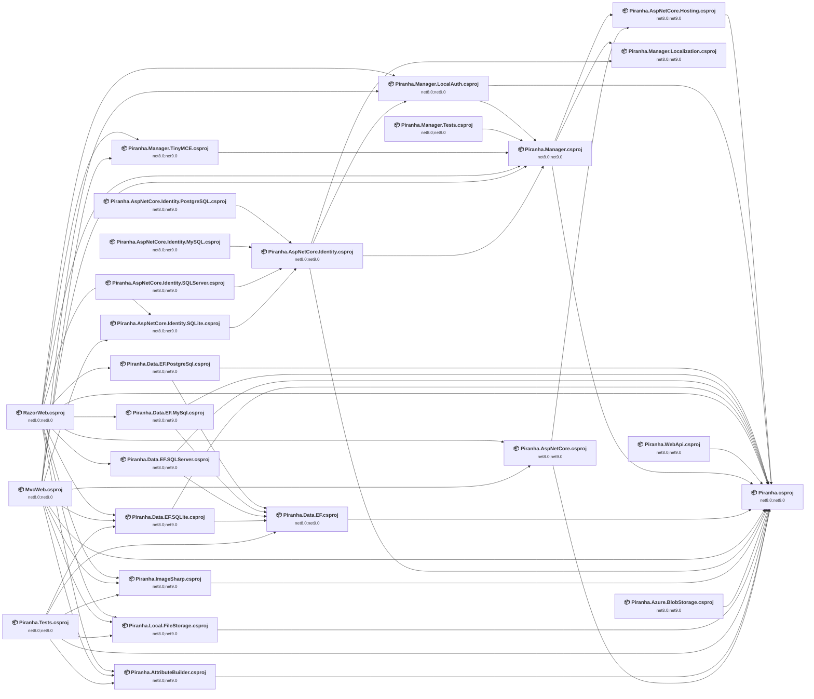

## Project Details

<a id="corepiranhaaspnetcorehostingpiranhaaspnetcorehostingcsproj"></a>
### core\Piranha.AspNetCore.Hosting\Piranha.AspNetCore.Hosting.csproj

#### Project Info

- **Current Target Framework:** net8.0;net9.0
- **Proposed Target Framework:** net8.0;net9.0;net10.0
- **SDK-style**: True
- **Project Kind:** ClassLibrary
- **Dependencies**: 1
- **Dependants**: 2
- **Number of Files**: 5
- **Number of Files with Incidents**: 1
- **Lines of Code**: 274
- **Estimated LOC to modify**: 0+ (at least 0.0% of the project)

#### Dependency Graph

Legend:
📦 SDK-style project
⚙️ Classic project

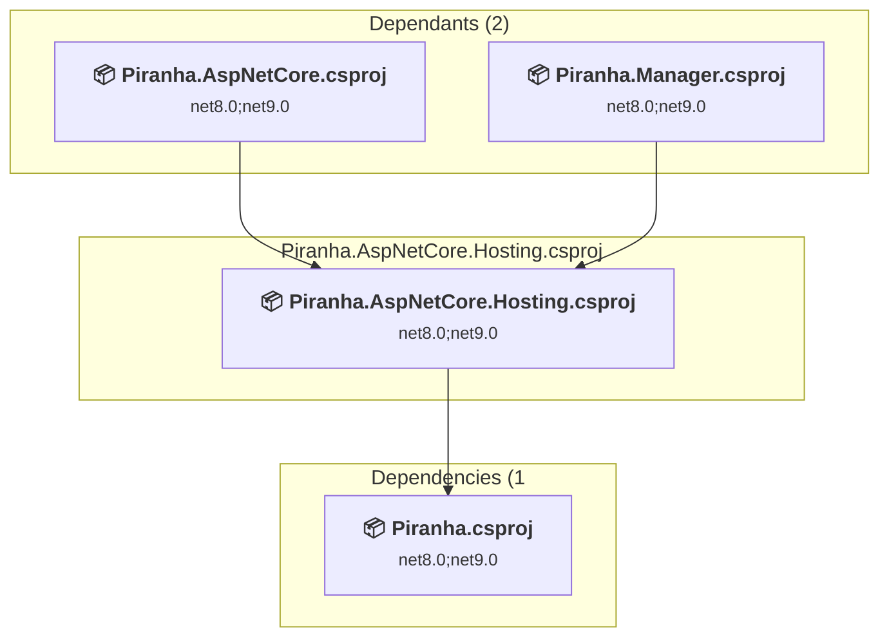

### API Compatibility

| Category | Count | Impact |
| :--- | :---: | :--- |
| 🔴 Binary Incompatible | 0 | High - Require code changes |
| 🟡 Source Incompatible | 0 | Medium - Needs re-compilation and potential conflicting API error fixing |
| 🔵 Behavioral change | 0 | Low - Behavioral changes that may require testing at runtime |
| ✅ Compatible | 125 |  |
| ***Total APIs Analyzed*** | ***125*** |  |

<a id="corepiranhaaspnetcorepiranhaaspnetcorecsproj"></a>
### core\Piranha.AspNetCore\Piranha.AspNetCore.csproj

#### Project Info

- **Current Target Framework:** net8.0;net9.0
- **Proposed Target Framework:** net8.0;net9.0;net10.0
- **SDK-style**: True
- **Project Kind:** ClassLibrary
- **Dependencies**: 2
- **Dependants**: 2
- **Number of Files**: 28
- **Number of Files with Incidents**: 4
- **Lines of Code**: 3015
- **Estimated LOC to modify**: 4+ (at least 0.1% of the project)

#### Dependency Graph

Legend:
📦 SDK-style project
⚙️ Classic project

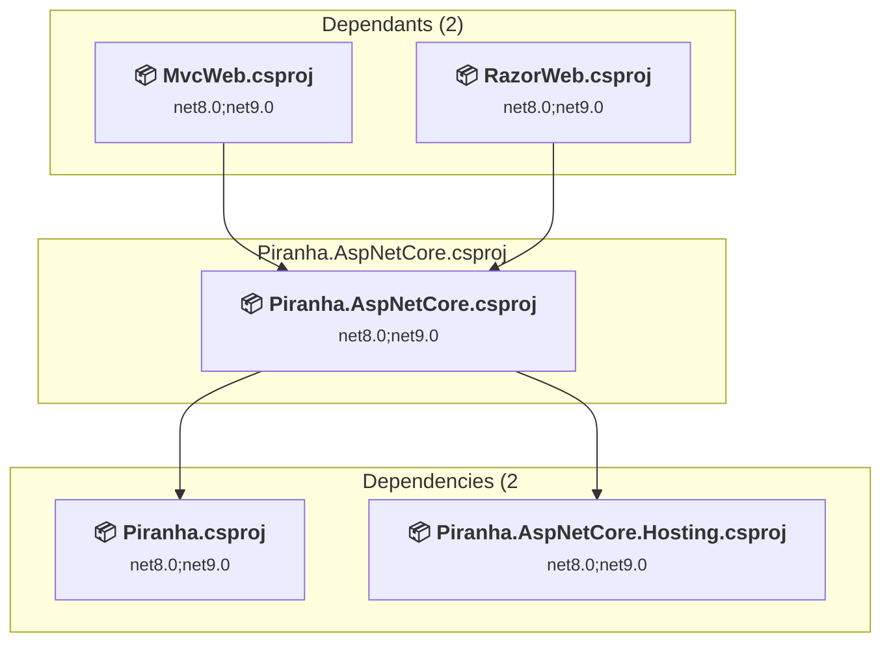

### API Compatibility

| Category | Count | Impact |
| :--- | :---: | :--- |
| 🔴 Binary Incompatible | 0 | High - Require code changes |
| 🟡 Source Incompatible | 2 | Medium - Needs re-compilation and potential conflicting API error fixing |
| 🔵 Behavioral change | 2 | Low - Behavioral changes that may require testing at runtime |
| ✅ Compatible | 1824 |  |
| ***Total APIs Analyzed*** | ***1828*** |  |

<a id="corepiranhaattributebuilderpiranhaattributebuildercsproj"></a>
### core\Piranha.AttributeBuilder\Piranha.AttributeBuilder.csproj

#### Project Info

- **Current Target Framework:** net8.0;net9.0
- **Proposed Target Framework:** net8.0;net9.0;net10.0
- **SDK-style**: True
- **Project Kind:** ClassLibrary
- **Dependencies**: 1
- **Dependants**: 3
- **Number of Files**: 9
- **Number of Files with Incidents**: 1
- **Lines of Code**: 1004
- **Estimated LOC to modify**: 0+ (at least 0.0% of the project)

#### Dependency Graph

Legend:
📦 SDK-style project
⚙️ Classic project

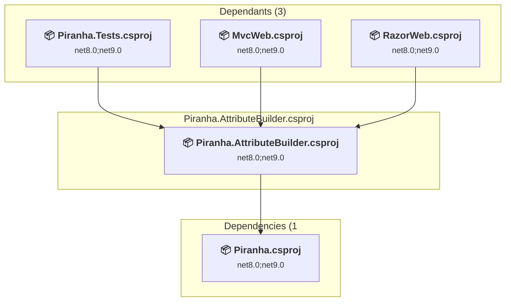

### API Compatibility

| Category | Count | Impact |
| :--- | :---: | :--- |
| 🔴 Binary Incompatible | 0 | High - Require code changes |
| 🟡 Source Incompatible | 0 | Medium - Needs re-compilation and potential conflicting API error fixing |
| 🔵 Behavioral change | 0 | Low - Behavioral changes that may require testing at runtime |
| ✅ Compatible | 758 |  |
| ***Total APIs Analyzed*** | ***758*** |  |

<a id="corepiranhaazureblobstoragepiranhaazureblobstoragecsproj"></a>
### core\Piranha.Azure.BlobStorage\Piranha.Azure.BlobStorage.csproj

#### Project Info

- **Current Target Framework:** net8.0;net9.0
- **Proposed Target Framework:** net8.0;net9.0;net10.0
- **SDK-style**: True
- **Project Kind:** ClassLibrary
- **Dependencies**: 1
- **Dependants**: 0
- **Number of Files**: 5
- **Number of Files with Incidents**: 3
- **Lines of Code**: 381
- **Estimated LOC to modify**: 8+ (at least 2.1% of the project)

#### Dependency Graph

Legend:
📦 SDK-style project
⚙️ Classic project

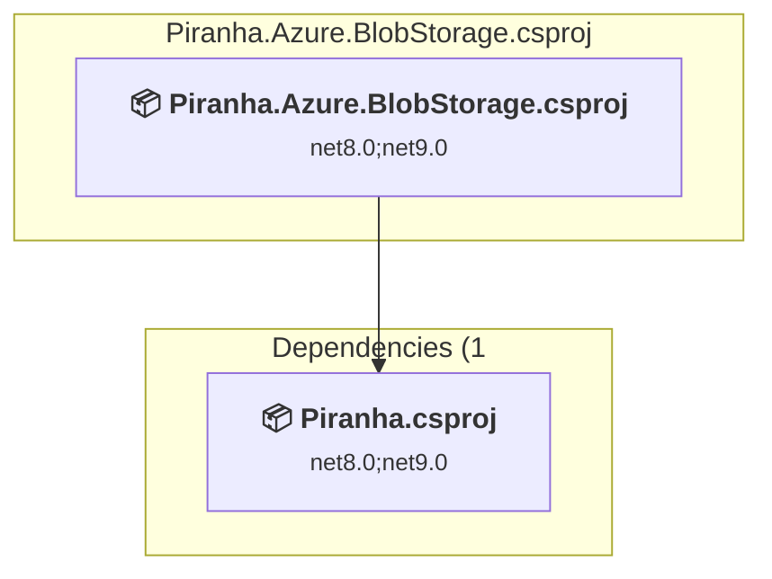

### API Compatibility

| Category | Count | Impact |
| :--- | :---: | :--- |
| 🔴 Binary Incompatible | 0 | High - Require code changes |
| 🟡 Source Incompatible | 0 | Medium - Needs re-compilation and potential conflicting API error fixing |
| 🔵 Behavioral change | 8 | Low - Behavioral changes that may require testing at runtime |
| ✅ Compatible | 166 |  |
| ***Total APIs Analyzed*** | ***174*** |  |

<a id="corepiranhaimagesharppiranhaimagesharpcsproj"></a>
### core\Piranha.ImageSharp\Piranha.ImageSharp.csproj

#### Project Info

- **Current Target Framework:** net8.0;net9.0
- **Proposed Target Framework:** net8.0;net9.0;net10.0
- **SDK-style**: True
- **Project Kind:** ClassLibrary
- **Dependencies**: 1
- **Dependants**: 3
- **Number of Files**: 2
- **Number of Files with Incidents**: 1
- **Lines of Code**: 195
- **Estimated LOC to modify**: 0+ (at least 0.0% of the project)

#### Dependency Graph

Legend:
📦 SDK-style project
⚙️ Classic project

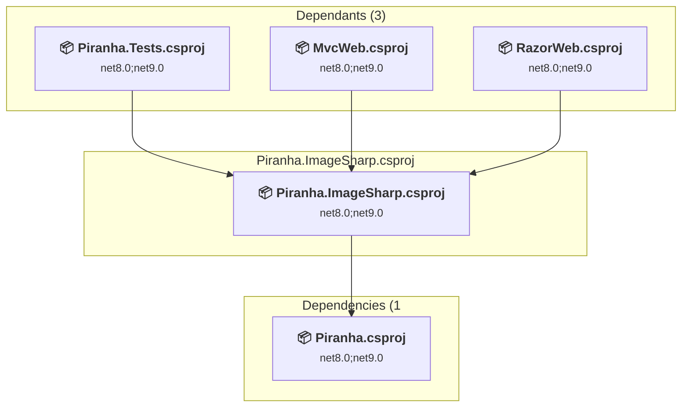

### API Compatibility

| Category | Count | Impact |
| :--- | :---: | :--- |
| 🔴 Binary Incompatible | 0 | High - Require code changes |
| 🟡 Source Incompatible | 0 | Medium - Needs re-compilation and potential conflicting API error fixing |
| 🔵 Behavioral change | 0 | Low - Behavioral changes that may require testing at runtime |
| ✅ Compatible | 189 |  |
| ***Total APIs Analyzed*** | ***189*** |  |

<a id="corepiranhalocalfilestoragepiranhalocalfilestoragecsproj"></a>
### core\Piranha.Local.FileStorage\Piranha.Local.FileStorage.csproj

#### Project Info

- **Current Target Framework:** net8.0;net9.0
- **Proposed Target Framework:** net8.0;net9.0;net10.0
- **SDK-style**: True
- **Project Kind:** ClassLibrary
- **Dependencies**: 1
- **Dependants**: 3
- **Number of Files**: 6
- **Number of Files with Incidents**: 1
- **Lines of Code**: 441
- **Estimated LOC to modify**: 0+ (at least 0.0% of the project)

#### Dependency Graph

Legend:
📦 SDK-style project
⚙️ Classic project

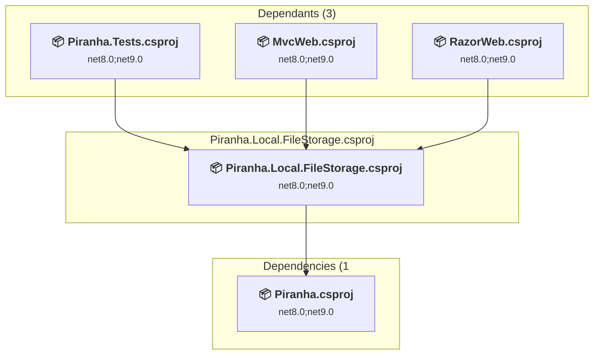

### API Compatibility

| Category | Count | Impact |
| :--- | :---: | :--- |
| 🔴 Binary Incompatible | 0 | High - Require code changes |
| 🟡 Source Incompatible | 0 | Medium - Needs re-compilation and potential conflicting API error fixing |
| 🔵 Behavioral change | 0 | Low - Behavioral changes that may require testing at runtime |
| ✅ Compatible | 226 |  |
| ***Total APIs Analyzed*** | ***226*** |  |

<a id="corepiranhamanagerlocalauthpiranhamanagerlocalauthcsproj"></a>
### core\Piranha.Manager.LocalAuth\Piranha.Manager.LocalAuth.csproj

#### Project Info

- **Current Target Framework:** net8.0;net9.0
- **Proposed Target Framework:** net8.0;net9.0;net10.0
- **SDK-style**: True
- **Project Kind:** ClassLibrary
- **Dependencies**: 2
- **Dependants**: 3
- **Number of Files**: 6
- **Number of Files with Incidents**: 1
- **Lines of Code**: 299
- **Estimated LOC to modify**: 0+ (at least 0.0% of the project)

#### Dependency Graph

Legend:
📦 SDK-style project
⚙️ Classic project

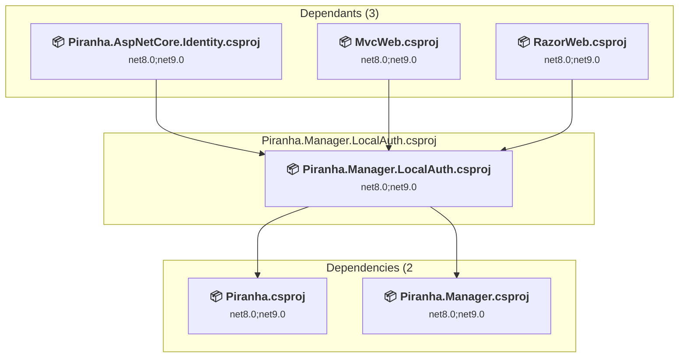

### API Compatibility

| Category | Count | Impact |
| :--- | :---: | :--- |
| 🔴 Binary Incompatible | 0 | High - Require code changes |
| 🟡 Source Incompatible | 0 | Medium - Needs re-compilation and potential conflicting API error fixing |
| 🔵 Behavioral change | 0 | Low - Behavioral changes that may require testing at runtime |
| ✅ Compatible | 527 |  |
| ***Total APIs Analyzed*** | ***527*** |  |

<a id="corepiranhamanagerlocalizationpiranhamanagerlocalizationcsproj"></a>
### core\Piranha.Manager.Localization\Piranha.Manager.Localization.csproj

#### Project Info

- **Current Target Framework:** net8.0;net9.0
- **Proposed Target Framework:** net8.0;net9.0;net10.0
- **SDK-style**: True
- **Project Kind:** ClassLibrary
- **Dependencies**: 0
- **Dependants**: 2
- **Number of Files**: 482
- **Number of Files with Incidents**: 1
- **Lines of Code**: 300
- **Estimated LOC to modify**: 0+ (at least 0.0% of the project)

#### Dependency Graph

Legend:
📦 SDK-style project
⚙️ Classic project

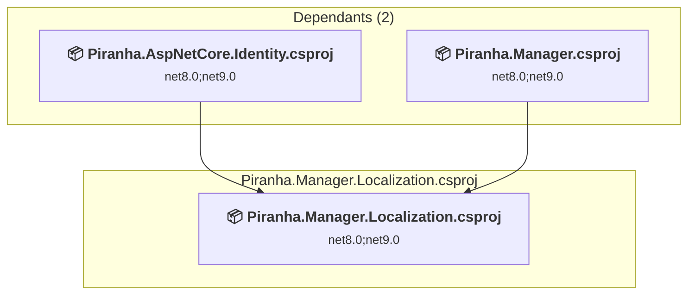

### API Compatibility

| Category | Count | Impact |
| :--- | :---: | :--- |
| 🔴 Binary Incompatible | 0 | High - Require code changes |
| 🟡 Source Incompatible | 0 | Medium - Needs re-compilation and potential conflicting API error fixing |
| 🔵 Behavioral change | 0 | Low - Behavioral changes that may require testing at runtime |
| ✅ Compatible | 110 |  |
| ***Total APIs Analyzed*** | ***110*** |  |

<a id="corepiranhamanagertinymcepiranhamanagertinymcecsproj"></a>
### core\Piranha.Manager.TinyMCE\Piranha.Manager.TinyMCE.csproj

#### Project Info

- **Current Target Framework:** net8.0;net9.0
- **Proposed Target Framework:** net8.0;net9.0;net10.0
- **SDK-style**: True
- **Project Kind:** ClassLibrary
- **Dependencies**: 1
- **Dependants**: 2
- **Number of Files**: 79
- **Number of Files with Incidents**: 1
- **Lines of Code**: 166
- **Estimated LOC to modify**: 0+ (at least 0.0% of the project)

#### Dependency Graph

Legend:
📦 SDK-style project
⚙️ Classic project

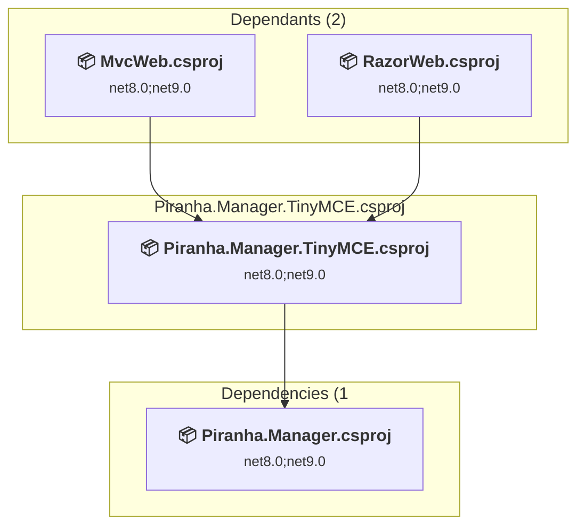

### API Compatibility

| Category | Count | Impact |
| :--- | :---: | :--- |
| 🔴 Binary Incompatible | 0 | High - Require code changes |
| 🟡 Source Incompatible | 0 | Medium - Needs re-compilation and potential conflicting API error fixing |
| 🔵 Behavioral change | 0 | Low - Behavioral changes that may require testing at runtime |
| ✅ Compatible | 70 |  |
| ***Total APIs Analyzed*** | ***70*** |  |

<a id="corepiranhamanagerpiranhamanagercsproj"></a>
### core\Piranha.Manager\Piranha.Manager.csproj

#### Project Info

- **Current Target Framework:** net8.0;net9.0
- **Proposed Target Framework:** net8.0;net9.0;net10.0
- **SDK-style**: True
- **Project Kind:** ClassLibrary
- **Dependencies**: 3
- **Dependants**: 6
- **Number of Files**: 242
- **Number of Files with Incidents**: 1
- **Lines of Code**: 14066
- **Estimated LOC to modify**: 0+ (at least 0.0% of the project)

#### Dependency Graph

Legend:
📦 SDK-style project
⚙️ Classic project

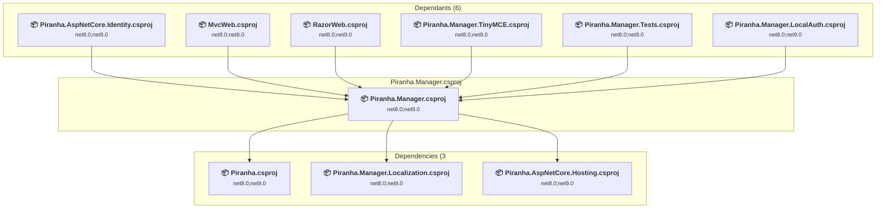

### API Compatibility

| Category | Count | Impact |
| :--- | :---: | :--- |
| 🔴 Binary Incompatible | 0 | High - Require code changes |
| 🟡 Source Incompatible | 0 | Medium - Needs re-compilation and potential conflicting API error fixing |
| 🔵 Behavioral change | 0 | Low - Behavioral changes that may require testing at runtime |
| ✅ Compatible | 20412 |  |
| ***Total APIs Analyzed*** | ***20412*** |  |

<a id="corepiranhawebapipiranhawebapicsproj"></a>
### core\Piranha.WebApi\Piranha.WebApi.csproj

#### Project Info

- **Current Target Framework:** net8.0;net9.0
- **Proposed Target Framework:** net8.0;net9.0;net10.0
- **SDK-style**: True
- **Project Kind:** ClassLibrary
- **Dependencies**: 1
- **Dependants**: 0
- **Number of Files**: 8
- **Number of Files with Incidents**: 1
- **Lines of Code**: 624
- **Estimated LOC to modify**: 0+ (at least 0.0% of the project)

#### Dependency Graph

Legend:
📦 SDK-style project
⚙️ Classic project

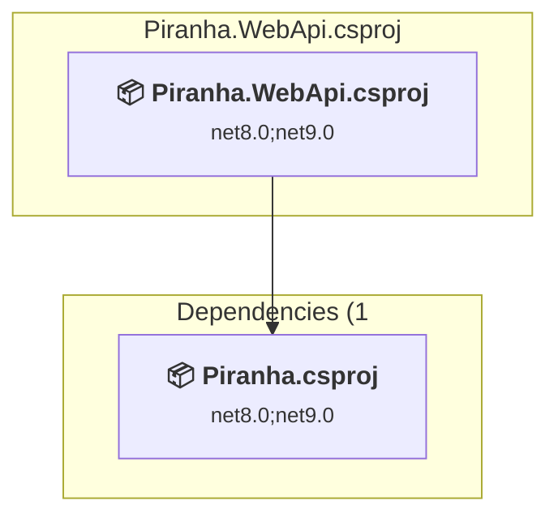

### API Compatibility

| Category | Count | Impact |
| :--- | :---: | :--- |
| 🔴 Binary Incompatible | 0 | High - Require code changes |
| 🟡 Source Incompatible | 0 | Medium - Needs re-compilation and potential conflicting API error fixing |
| 🔵 Behavioral change | 0 | Low - Behavioral changes that may require testing at runtime |
| ✅ Compatible | 470 |  |
| ***Total APIs Analyzed*** | ***470*** |  |

<a id="corepiranhapiranhacsproj"></a>
### core\Piranha\Piranha.csproj

#### Project Info

- **Current Target Framework:** net8.0;net9.0
- **Proposed Target Framework:** net8.0;net9.0;net10.0
- **SDK-style**: True
- **Project Kind:** ClassLibrary
- **Dependencies**: 0
- **Dependants**: 18
- **Number of Files**: 220
- **Number of Files with Incidents**: 2
- **Lines of Code**: 19002
- **Estimated LOC to modify**: 1+ (at least 0.0% of the project)

#### Dependency Graph

Legend:
📦 SDK-style project
⚙️ Classic project

```mermaid
flowchart TB
    subgraph upstream["Dependants (18)"]
        P2["<b>📦&nbsp;Piranha.AspNetCore.csproj</b><br/><small>net8.0;net9.0</small>"]
        P3["<b>📦&nbsp;Piranha.AttributeBuilder.csproj</b><br/><small>net8.0;net9.0</small>"]
        P4["<b>📦&nbsp;Piranha.Tests.csproj</b><br/><small>net8.0;net9.0</small>"]
        P5["<b>📦&nbsp;Piranha.Local.FileStorage.csproj</b><br/><small>net8.0;net9.0</small>"]
        P6["<b>📦&nbsp;Piranha.Azure.BlobStorage.csproj</b><br/><small>net8.0;net9.0</small>"]
        P7["<b>📦&nbsp;Piranha.ImageSharp.csproj</b><br/><small>net8.0;net9.0</small>"]
        P8["<b>📦&nbsp;Piranha.AspNetCore.Identity.csproj</b><br/><small>net8.0;net9.0</small>"]
        P11["<b>📦&nbsp;MvcWeb.csproj</b><br/><small>net8.0;net9.0</small>"]
        P12["<b>📦&nbsp;Piranha.Data.EF.csproj</b><br/><small>net8.0;net9.0</small>"]
        P13["<b>📦&nbsp;Piranha.Manager.csproj</b><br/><small>net8.0;net9.0</small>"]
        P15["<b>📦&nbsp;Piranha.WebApi.csproj</b><br/><small>net8.0;net9.0</small>"]
        P16["<b>📦&nbsp;RazorWeb.csproj</b><br/><small>net8.0;net9.0</small>"]
        P19["<b>📦&nbsp;Piranha.Data.EF.SQLite.csproj</b><br/><small>net8.0;net9.0</small>"]
        P20["<b>📦&nbsp;Piranha.Data.EF.SQLServer.csproj</b><br/><small>net8.0;net9.0</small>"]
        P21["<b>📦&nbsp;Piranha.Data.EF.MySql.csproj</b><br/><small>net8.0;net9.0</small>"]
        P22["<b>📦&nbsp;Piranha.Data.EF.PostgreSql.csproj</b><br/><small>net8.0;net9.0</small>"]
        P25["<b>📦&nbsp;Piranha.Manager.LocalAuth.csproj</b><br/><small>net8.0;net9.0</small>"]
        P26["<b>📦&nbsp;Piranha.AspNetCore.Hosting.csproj</b><br/><small>net8.0;net9.0</small>"]
        click P2 "#corepiranhaaspnetcorepiranhaaspnetcorecsproj"
        click P3 "#corepiranhaattributebuilderpiranhaattributebuildercsproj"
        click P4 "#testpiranhatestspiranhatestscsproj"
        click P5 "#corepiranhalocalfilestoragepiranhalocalfilestoragecsproj"
        click P6 "#corepiranhaazureblobstoragepiranhaazureblobstoragecsproj"
        click P7 "#corepiranhaimagesharppiranhaimagesharpcsproj"
        click P8 "#identitypiranhaaspnetcoreidentitypiranhaaspnetcoreidentitycsproj"
        click P11 "#examplesmvcwebmvcwebcsproj"
        click P12 "#datapiranhadataefpiranhadataefcsproj"
        click P13 "#corepiranhamanagerpiranhamanagercsproj"
        click P15 "#corepiranhawebapipiranhawebapicsproj"
        click P16 "#examplesrazorwebrazorwebcsproj"
        click P19 "#datapiranhadataefsqlitepiranhadataefsqlitecsproj"
        click P20 "#datapiranhadataefsqlserverpiranhadataefsqlservercsproj"
        click P21 "#datapiranhadataefmysqlpiranhadataefmysqlcsproj"
        click P22 "#datapiranhadataefpostgresqlpiranhadataefpostgresqlcsproj"
        click P25 "#corepiranhamanagerlocalauthpiranhamanagerlocalauthcsproj"
        click P26 "#corepiranhaaspnetcorehostingpiranhaaspnetcorehostingcsproj"
    end
    subgraph current["Piranha.csproj"]
        MAIN["<b>📦&nbsp;Piranha.csproj</b><br/><small>net8.0;net9.0</small>"]
        click MAIN "#corepiranhapiranhacsproj"
    end
    P2 --> MAIN
    P3 --> MAIN
    P4 --> MAIN
    P5 --> MAIN
    P6 --> MAIN
    P7 --> MAIN
    P8 --> MAIN
    P11 --> MAIN
    P12 --> MAIN
    P13 --> MAIN
    P15 --> MAIN
    P16 --> MAIN
    P19 --> MAIN
    P20 --> MAIN
    P21 --> MAIN
    P22 --> MAIN
    P25 --> MAIN
    P26 --> MAIN

```

### API Compatibility

| Category | Count | Impact |
| :--- | :---: | :--- |
| 🔴 Binary Incompatible | 0 | High - Require code changes |
| 🟡 Source Incompatible | 0 | Medium - Needs re-compilation and potential conflicting API error fixing |
| 🔵 Behavioral change | 1 | Low - Behavioral changes that may require testing at runtime |
| ✅ Compatible | 9651 |  |
| ***Total APIs Analyzed*** | ***9652*** |  |

<a id="datapiranhadataefmysqlpiranhadataefmysqlcsproj"></a>
### data\Piranha.Data.EF.MySql\Piranha.Data.EF.MySql.csproj

#### Project Info

- **Current Target Framework:** net8.0;net9.0
- **Proposed Target Framework:** net8.0;net9.0;net10.0
- **SDK-style**: True
- **Project Kind:** ClassLibrary
- **Dependencies**: 2
- **Dependants**: 1
- **Number of Files**: 51
- **Number of Files with Incidents**: 1
- **Lines of Code**: 26182
- **Estimated LOC to modify**: 0+ (at least 0.0% of the project)

#### Dependency Graph

Legend:
📦 SDK-style project
⚙️ Classic project

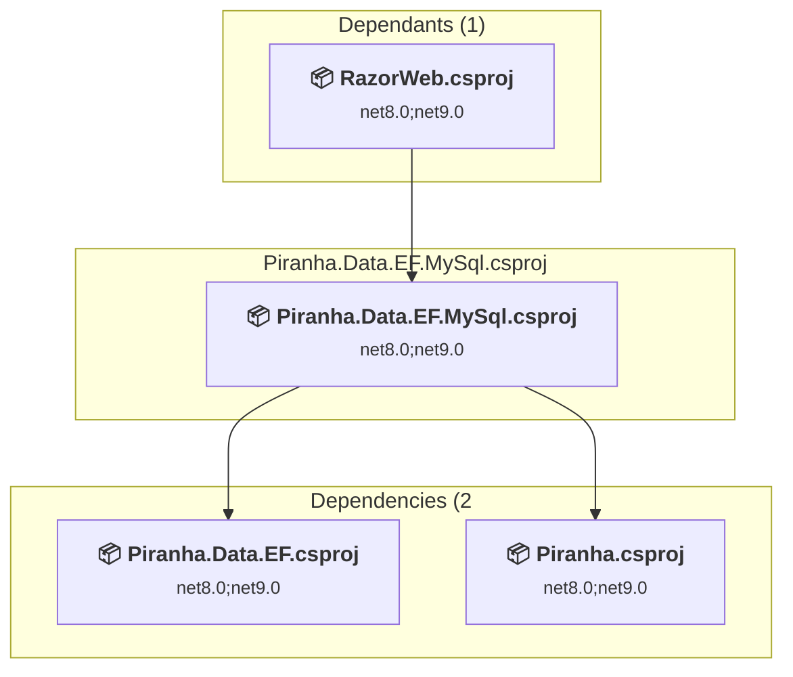

### API Compatibility

| Category | Count | Impact |
| :--- | :---: | :--- |
| 🔴 Binary Incompatible | 0 | High - Require code changes |
| 🟡 Source Incompatible | 0 | Medium - Needs re-compilation and potential conflicting API error fixing |
| 🔵 Behavioral change | 0 | Low - Behavioral changes that may require testing at runtime |
| ✅ Compatible | 35744 |  |
| ***Total APIs Analyzed*** | ***35744*** |  |

<a id="datapiranhadataefpostgresqlpiranhadataefpostgresqlcsproj"></a>
### data\Piranha.Data.EF.PostgreSql\Piranha.Data.EF.PostgreSql.csproj

#### Project Info

- **Current Target Framework:** net8.0;net9.0
- **Proposed Target Framework:** net8.0;net9.0;net10.0
- **SDK-style**: True
- **Project Kind:** ClassLibrary
- **Dependencies**: 2
- **Dependants**: 1
- **Number of Files**: 51
- **Number of Files with Incidents**: 1
- **Lines of Code**: 26200
- **Estimated LOC to modify**: 0+ (at least 0.0% of the project)

#### Dependency Graph

Legend:
📦 SDK-style project
⚙️ Classic project

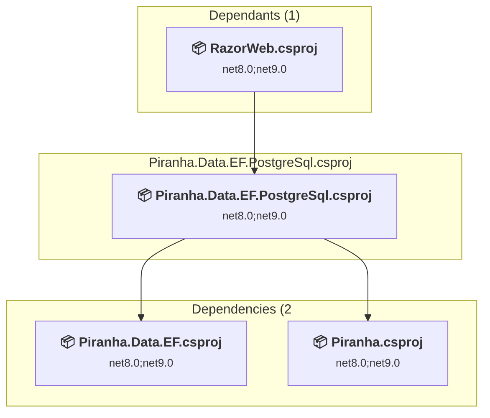

### API Compatibility

| Category | Count | Impact |
| :--- | :---: | :--- |
| 🔴 Binary Incompatible | 0 | High - Require code changes |
| 🟡 Source Incompatible | 0 | Medium - Needs re-compilation and potential conflicting API error fixing |
| 🔵 Behavioral change | 0 | Low - Behavioral changes that may require testing at runtime |
| ✅ Compatible | 35784 |  |
| ***Total APIs Analyzed*** | ***35784*** |  |

<a id="datapiranhadataefsqlitepiranhadataefsqlitecsproj"></a>
### data\Piranha.Data.EF.SQLite\Piranha.Data.EF.SQLite.csproj

#### Project Info

- **Current Target Framework:** net8.0;net9.0
- **Proposed Target Framework:** net8.0;net9.0;net10.0
- **SDK-style**: True
- **Project Kind:** ClassLibrary
- **Dependencies**: 2
- **Dependants**: 3
- **Number of Files**: 51
- **Number of Files with Incidents**: 1
- **Lines of Code**: 26153
- **Estimated LOC to modify**: 0+ (at least 0.0% of the project)

#### Dependency Graph

Legend:
📦 SDK-style project
⚙️ Classic project

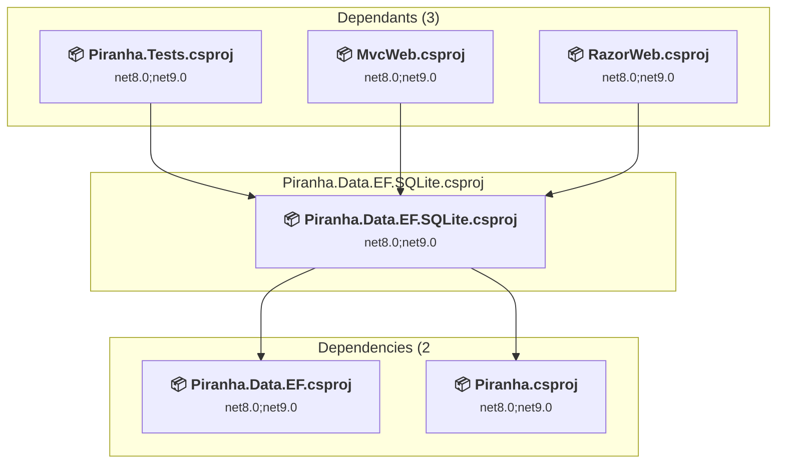

### API Compatibility

| Category | Count | Impact |
| :--- | :---: | :--- |
| 🔴 Binary Incompatible | 0 | High - Require code changes |
| 🟡 Source Incompatible | 0 | Medium - Needs re-compilation and potential conflicting API error fixing |
| 🔵 Behavioral change | 0 | Low - Behavioral changes that may require testing at runtime |
| ✅ Compatible | 35719 |  |
| ***Total APIs Analyzed*** | ***35719*** |  |

<a id="datapiranhadataefsqlserverpiranhadataefsqlservercsproj"></a>
### data\Piranha.Data.EF.SQLServer\Piranha.Data.EF.SQLServer.csproj

#### Project Info

- **Current Target Framework:** net8.0;net9.0
- **Proposed Target Framework:** net8.0;net9.0;net10.0
- **SDK-style**: True
- **Project Kind:** ClassLibrary
- **Dependencies**: 2
- **Dependants**: 1
- **Number of Files**: 51
- **Number of Files with Incidents**: 1
- **Lines of Code**: 26214
- **Estimated LOC to modify**: 0+ (at least 0.0% of the project)

#### Dependency Graph

Legend:
📦 SDK-style project
⚙️ Classic project


### API Compatibility

| Category | Count | Impact |
| :--- | :---: | :--- |
| 🔴 Binary Incompatible | 0 | High - Require code changes |
| 🟡 Source Incompatible | 0 | Medium - Needs re-compilation and potential conflicting API error fixing |
| 🔵 Behavioral change | 0 | Low - Behavioral changes that may require testing at runtime |
| ✅ Compatible | 35799 |  |
| ***Total APIs Analyzed*** | ***35799*** |  |

<a id="datapiranhadataefpiranhadataefcsproj"></a>
### data\Piranha.Data.EF\Piranha.Data.EF.csproj

#### Project Info

- **Current Target Framework:** net8.0;net9.0
- **Proposed Target Framework:** net8.0;net9.0;net10.0
- **SDK-style**: True
- **Project Kind:** ClassLibrary
- **Dependencies**: 1
- **Dependants**: 5
- **Number of Files**: 74
- **Number of Files with Incidents**: 1
- **Lines of Code**: 8730
- **Estimated LOC to modify**: 0+ (at least 0.0% of the project)

#### Dependency Graph

Legend:
📦 SDK-style project
⚙️ Classic project

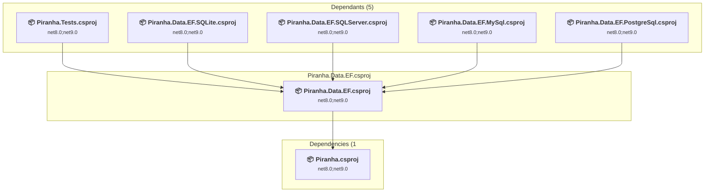

### API Compatibility

| Category | Count | Impact |
| :--- | :---: | :--- |
| 🔴 Binary Incompatible | 0 | High - Require code changes |
| 🟡 Source Incompatible | 0 | Medium - Needs re-compilation and potential conflicting API error fixing |
| 🔵 Behavioral change | 0 | Low - Behavioral changes that may require testing at runtime |
| ✅ Compatible | 10058 |  |
| ***Total APIs Analyzed*** | ***10058*** |  |

<a id="examplesmvcwebmvcwebcsproj"></a>
### examples\MvcWeb\MvcWeb.csproj

#### Project Info

- **Current Target Framework:** net8.0;net9.0
- **Proposed Target Framework:** net8.0;net9.0;net10.0
- **SDK-style**: True
- **Project Kind:** AspNetCore
- **Dependencies**: 10
- **Dependants**: 0
- **Number of Files**: 32
- **Number of Files with Incidents**: 1
- **Lines of Code**: 978
- **Estimated LOC to modify**: 0+ (at least 0.0% of the project)

#### Dependency Graph

Legend:
📦 SDK-style project
⚙️ Classic project

```mermaid
flowchart TB
    subgraph current["MvcWeb.csproj"]
        MAIN["<b>📦&nbsp;MvcWeb.csproj</b><br/><small>net8.0;net9.0</small>"]
        click MAIN "#examplesmvcwebmvcwebcsproj"
    end
    subgraph downstream["Dependencies (10"]
        P2["<b>📦&nbsp;Piranha.AspNetCore.csproj</b><br/><small>net8.0;net9.0</small>"]
        P1["<b>📦&nbsp;Piranha.csproj</b><br/><small>net8.0;net9.0</small>"]
        P17["<b>📦&nbsp;Piranha.Manager.TinyMCE.csproj</b><br/><small>net8.0;net9.0</small>"]
        P13["<b>📦&nbsp;Piranha.Manager.csproj</b><br/><small>net8.0;net9.0</small>"]
        P5["<b>📦&nbsp;Piranha.Local.FileStorage.csproj</b><br/><small>net8.0;net9.0</small>"]
        P3["<b>📦&nbsp;Piranha.AttributeBuilder.csproj</b><br/><small>net8.0;net9.0</small>"]
        P25["<b>📦&nbsp;Piranha.Manager.LocalAuth.csproj</b><br/><small>net8.0;net9.0</small>"]
        P9["<b>📦&nbsp;Piranha.AspNetCore.Identity.SQLite.csproj</b><br/><small>net8.0;net9.0</small>"]
        P19["<b>📦&nbsp;Piranha.Data.EF.SQLite.csproj</b><br/><small>net8.0;net9.0</small>"]
        P7["<b>📦&nbsp;Piranha.ImageSharp.csproj</b><br/><small>net8.0;net9.0</small>"]
        click P2 "#corepiranhaaspnetcorepiranhaaspnetcorecsproj"
        click P1 "#corepiranhapiranhacsproj"
        click P17 "#corepiranhamanagertinymcepiranhamanagertinymcecsproj"
        click P13 "#corepiranhamanagerpiranhamanagercsproj"
        click P5 "#corepiranhalocalfilestoragepiranhalocalfilestoragecsproj"
        click P3 "#corepiranhaattributebuilderpiranhaattributebuildercsproj"
        click P25 "#corepiranhamanagerlocalauthpiranhamanagerlocalauthcsproj"
        click P9 "#identitypiranhaaspnetcoreidentitysqlitepiranhaaspnetcoreidentitysqlitecsproj"
        click P19 "#datapiranhadataefsqlitepiranhadataefsqlitecsproj"
        click P7 "#corepiranhaimagesharppiranhaimagesharpcsproj"
    end
    MAIN --> P2
    MAIN --> P1
    MAIN --> P17
    MAIN --> P13
    MAIN --> P5
    MAIN --> P3
    MAIN --> P25
    MAIN --> P9
    MAIN --> P19
    MAIN --> P7

```

### API Compatibility

| Category | Count | Impact |
| :--- | :---: | :--- |
| 🔴 Binary Incompatible | 0 | High - Require code changes |
| 🟡 Source Incompatible | 0 | Medium - Needs re-compilation and potential conflicting API error fixing |
| 🔵 Behavioral change | 0 | Low - Behavioral changes that may require testing at runtime |
| ✅ Compatible | 2371 |  |
| ***Total APIs Analyzed*** | ***2371*** |  |

<a id="examplesrazorwebrazorwebcsproj"></a>
### examples\RazorWeb\RazorWeb.csproj

#### Project Info

- **Current Target Framework:** net8.0;net9.0
- **Proposed Target Framework:** net8.0;net9.0;net10.0
- **SDK-style**: True
- **Project Kind:** AspNetCore
- **Dependencies**: 13
- **Dependants**: 0
- **Number of Files**: 32
- **Number of Files with Incidents**: 1
- **Lines of Code**: 1215
- **Estimated LOC to modify**: 0+ (at least 0.0% of the project)

#### Dependency Graph

Legend:
📦 SDK-style project
⚙️ Classic project

```mermaid
flowchart TB
    subgraph current["RazorWeb.csproj"]
        MAIN["<b>📦&nbsp;RazorWeb.csproj</b><br/><small>net8.0;net9.0</small>"]
        click MAIN "#examplesrazorwebrazorwebcsproj"
    end
    subgraph downstream["Dependencies (13"]
        P2["<b>📦&nbsp;Piranha.AspNetCore.csproj</b><br/><small>net8.0;net9.0</small>"]
        P1["<b>📦&nbsp;Piranha.csproj</b><br/><small>net8.0;net9.0</small>"]
        P17["<b>📦&nbsp;Piranha.Manager.TinyMCE.csproj</b><br/><small>net8.0;net9.0</small>"]
        P21["<b>📦&nbsp;Piranha.Data.EF.MySql.csproj</b><br/><small>net8.0;net9.0</small>"]
        P13["<b>📦&nbsp;Piranha.Manager.csproj</b><br/><small>net8.0;net9.0</small>"]
        P5["<b>📦&nbsp;Piranha.Local.FileStorage.csproj</b><br/><small>net8.0;net9.0</small>"]
        P3["<b>📦&nbsp;Piranha.AttributeBuilder.csproj</b><br/><small>net8.0;net9.0</small>"]
        P25["<b>📦&nbsp;Piranha.Manager.LocalAuth.csproj</b><br/><small>net8.0;net9.0</small>"]
        P20["<b>📦&nbsp;Piranha.Data.EF.SQLServer.csproj</b><br/><small>net8.0;net9.0</small>"]
        P9["<b>📦&nbsp;Piranha.AspNetCore.Identity.SQLite.csproj</b><br/><small>net8.0;net9.0</small>"]
        P19["<b>📦&nbsp;Piranha.Data.EF.SQLite.csproj</b><br/><small>net8.0;net9.0</small>"]
        P7["<b>📦&nbsp;Piranha.ImageSharp.csproj</b><br/><small>net8.0;net9.0</small>"]
        P22["<b>📦&nbsp;Piranha.Data.EF.PostgreSql.csproj</b><br/><small>net8.0;net9.0</small>"]
        click P2 "#corepiranhaaspnetcorepiranhaaspnetcorecsproj"
        click P1 "#corepiranhapiranhacsproj"
        click P17 "#corepiranhamanagertinymcepiranhamanagertinymcecsproj"
        click P21 "#datapiranhadataefmysqlpiranhadataefmysqlcsproj"
        click P13 "#corepiranhamanagerpiranhamanagercsproj"
        click P5 "#corepiranhalocalfilestoragepiranhalocalfilestoragecsproj"
        click P3 "#corepiranhaattributebuilderpiranhaattributebuildercsproj"
        click P25 "#corepiranhamanagerlocalauthpiranhamanagerlocalauthcsproj"
        click P20 "#datapiranhadataefsqlserverpiranhadataefsqlservercsproj"
        click P9 "#identitypiranhaaspnetcoreidentitysqlitepiranhaaspnetcoreidentitysqlitecsproj"
        click P19 "#datapiranhadataefsqlitepiranhadataefsqlitecsproj"
        click P7 "#corepiranhaimagesharppiranhaimagesharpcsproj"
        click P22 "#datapiranhadataefpostgresqlpiranhadataefpostgresqlcsproj"
    end
    MAIN --> P2
    MAIN --> P1
    MAIN --> P17
    MAIN --> P21
    MAIN --> P13
    MAIN --> P5
    MAIN --> P3
    MAIN --> P25
    MAIN --> P20
    MAIN --> P9
    MAIN --> P19
    MAIN --> P7
    MAIN --> P22

```

### API Compatibility

| Category | Count | Impact |
| :--- | :---: | :--- |
| 🔴 Binary Incompatible | 0 | High - Require code changes |
| 🟡 Source Incompatible | 0 | Medium - Needs re-compilation and potential conflicting API error fixing |
| 🔵 Behavioral change | 0 | Low - Behavioral changes that may require testing at runtime |
| ✅ Compatible | 2651 |  |
| ***Total APIs Analyzed*** | ***2651*** |  |

<a id="identitypiranhaaspnetcoreidentitymysqlpiranhaaspnetcoreidentitymysqlcsproj"></a>
### identity\Piranha.AspNetCore.Identity.MySQL\Piranha.AspNetCore.Identity.MySQL.csproj

#### Project Info

- **Current Target Framework:** net8.0;net9.0
- **Proposed Target Framework:** net8.0;net9.0;net10.0
- **SDK-style**: True
- **Project Kind:** ClassLibrary
- **Dependencies**: 1
- **Dependants**: 0
- **Number of Files**: 5
- **Number of Files with Incidents**: 1
- **Lines of Code**: 733
- **Estimated LOC to modify**: 0+ (at least 0.0% of the project)

#### Dependency Graph

Legend:
📦 SDK-style project
⚙️ Classic project

```mermaid
flowchart TB
    subgraph current["Piranha.AspNetCore.Identity.MySQL.csproj"]
        MAIN["<b>📦&nbsp;Piranha.AspNetCore.Identity.MySQL.csproj</b><br/><small>net8.0;net9.0</small>"]
        click MAIN "#identitypiranhaaspnetcoreidentitymysqlpiranhaaspnetcoreidentitymysqlcsproj"
    end
    subgraph downstream["Dependencies (1"]
        P8["<b>📦&nbsp;Piranha.AspNetCore.Identity.csproj</b><br/><small>net8.0;net9.0</small>"]
        click P8 "#identitypiranhaaspnetcoreidentitypiranhaaspnetcoreidentitycsproj"
    end
    MAIN --> P8

```

### API Compatibility

| Category | Count | Impact |
| :--- | :---: | :--- |
| 🔴 Binary Incompatible | 0 | High - Require code changes |
| 🟡 Source Incompatible | 0 | Medium - Needs re-compilation and potential conflicting API error fixing |
| 🔵 Behavioral change | 0 | Low - Behavioral changes that may require testing at runtime |
| ✅ Compatible | 785 |  |
| ***Total APIs Analyzed*** | ***785*** |  |

<a id="identitypiranhaaspnetcoreidentitypostgresqlpiranhaaspnetcoreidentitypostgresqlcsproj"></a>
### identity\Piranha.AspNetCore.Identity.PostgreSQL\Piranha.AspNetCore.Identity.PostgreSQL.csproj

#### Project Info

- **Current Target Framework:** net8.0;net9.0
- **Proposed Target Framework:** net8.0;net9.0;net10.0
- **SDK-style**: True
- **Project Kind:** ClassLibrary
- **Dependencies**: 1
- **Dependants**: 0
- **Number of Files**: 5
- **Number of Files with Incidents**: 1
- **Lines of Code**: 728
- **Estimated LOC to modify**: 0+ (at least 0.0% of the project)

#### Dependency Graph

Legend:
📦 SDK-style project
⚙️ Classic project

```mermaid
flowchart TB
    subgraph current["Piranha.AspNetCore.Identity.PostgreSQL.csproj"]
        MAIN["<b>📦&nbsp;Piranha.AspNetCore.Identity.PostgreSQL.csproj</b><br/><small>net8.0;net9.0</small>"]
        click MAIN "#identitypiranhaaspnetcoreidentitypostgresqlpiranhaaspnetcoreidentitypostgresqlcsproj"
    end
    subgraph downstream["Dependencies (1"]
        P8["<b>📦&nbsp;Piranha.AspNetCore.Identity.csproj</b><br/><small>net8.0;net9.0</small>"]
        click P8 "#identitypiranhaaspnetcoreidentitypiranhaaspnetcoreidentitycsproj"
    end
    MAIN --> P8

```

### API Compatibility

| Category | Count | Impact |
| :--- | :---: | :--- |
| 🔴 Binary Incompatible | 0 | High - Require code changes |
| 🟡 Source Incompatible | 0 | Medium - Needs re-compilation and potential conflicting API error fixing |
| 🔵 Behavioral change | 0 | Low - Behavioral changes that may require testing at runtime |
| ✅ Compatible | 804 |  |
| ***Total APIs Analyzed*** | ***804*** |  |

<a id="identitypiranhaaspnetcoreidentitysqlitepiranhaaspnetcoreidentitysqlitecsproj"></a>
### identity\Piranha.AspNetCore.Identity.SQLite\Piranha.AspNetCore.Identity.SQLite.csproj

#### Project Info

- **Current Target Framework:** net8.0;net9.0
- **Proposed Target Framework:** net8.0;net9.0;net10.0
- **SDK-style**: True
- **Project Kind:** ClassLibrary
- **Dependencies**: 1
- **Dependants**: 2
- **Number of Files**: 5
- **Number of Files with Incidents**: 1
- **Lines of Code**: 728
- **Estimated LOC to modify**: 0+ (at least 0.0% of the project)

#### Dependency Graph

Legend:
📦 SDK-style project
⚙️ Classic project

```mermaid
flowchart TB
    subgraph upstream["Dependants (2)"]
        P11["<b>📦&nbsp;MvcWeb.csproj</b><br/><small>net8.0;net9.0</small>"]
        P16["<b>📦&nbsp;RazorWeb.csproj</b><br/><small>net8.0;net9.0</small>"]
        click P11 "#examplesmvcwebmvcwebcsproj"
        click P16 "#examplesrazorwebrazorwebcsproj"
    end
    subgraph current["Piranha.AspNetCore.Identity.SQLite.csproj"]
        MAIN["<b>📦&nbsp;Piranha.AspNetCore.Identity.SQLite.csproj</b><br/><small>net8.0;net9.0</small>"]
        click MAIN "#identitypiranhaaspnetcoreidentitysqlitepiranhaaspnetcoreidentitysqlitecsproj"
    end
    subgraph downstream["Dependencies (1"]
        P8["<b>📦&nbsp;Piranha.AspNetCore.Identity.csproj</b><br/><small>net8.0;net9.0</small>"]
        click P8 "#identitypiranhaaspnetcoreidentitypiranhaaspnetcoreidentitycsproj"
    end
    P11 --> MAIN
    P16 --> MAIN
    MAIN --> P8

```

### API Compatibility

| Category | Count | Impact |
| :--- | :---: | :--- |
| 🔴 Binary Incompatible | 0 | High - Require code changes |
| 🟡 Source Incompatible | 0 | Medium - Needs re-compilation and potential conflicting API error fixing |
| 🔵 Behavioral change | 0 | Low - Behavioral changes that may require testing at runtime |
| ✅ Compatible | 766 |  |
| ***Total APIs Analyzed*** | ***766*** |  |

<a id="identitypiranhaaspnetcoreidentitysqlserverpiranhaaspnetcoreidentitysqlservercsproj"></a>
### identity\Piranha.AspNetCore.Identity.SQLServer\Piranha.AspNetCore.Identity.SQLServer.csproj

#### Project Info

- **Current Target Framework:** net8.0;net9.0
- **Proposed Target Framework:** net8.0;net9.0;net10.0
- **SDK-style**: True
- **Project Kind:** ClassLibrary
- **Dependencies**: 1
- **Dependants**: 0
- **Number of Files**: 5
- **Number of Files with Incidents**: 1
- **Lines of Code**: 737
- **Estimated LOC to modify**: 0+ (at least 0.0% of the project)

#### Dependency Graph

Legend:
📦 SDK-style project
⚙️ Classic project

```mermaid
flowchart TB
    subgraph current["Piranha.AspNetCore.Identity.SQLServer.csproj"]
        MAIN["<b>📦&nbsp;Piranha.AspNetCore.Identity.SQLServer.csproj</b><br/><small>net8.0;net9.0</small>"]
        click MAIN "#identitypiranhaaspnetcoreidentitysqlserverpiranhaaspnetcoreidentitysqlservercsproj"
    end
    subgraph downstream["Dependencies (1"]
        P8["<b>📦&nbsp;Piranha.AspNetCore.Identity.csproj</b><br/><small>net8.0;net9.0</small>"]
        click P8 "#identitypiranhaaspnetcoreidentitypiranhaaspnetcoreidentitycsproj"
    end
    MAIN --> P8

```

### API Compatibility

| Category | Count | Impact |
| :--- | :---: | :--- |
| 🔴 Binary Incompatible | 0 | High - Require code changes |
| 🟡 Source Incompatible | 0 | Medium - Needs re-compilation and potential conflicting API error fixing |
| 🔵 Behavioral change | 0 | Low - Behavioral changes that may require testing at runtime |
| ✅ Compatible | 794 |  |
| ***Total APIs Analyzed*** | ***794*** |  |

<a id="identitypiranhaaspnetcoreidentitypiranhaaspnetcoreidentitycsproj"></a>
### identity\Piranha.AspNetCore.Identity\Piranha.AspNetCore.Identity.csproj

#### Project Info

- **Current Target Framework:** net8.0;net9.0
- **Proposed Target Framework:** net8.0;net9.0;net10.0
- **SDK-style**: True
- **Project Kind:** ClassLibrary
- **Dependencies**: 4
- **Dependants**: 4
- **Number of Files**: 26
- **Number of Files with Incidents**: 2
- **Lines of Code**: 1989
- **Estimated LOC to modify**: 4+ (at least 0.2% of the project)

#### Dependency Graph

Legend:
📦 SDK-style project
⚙️ Classic project

```mermaid
flowchart TB
    subgraph upstream["Dependants (4)"]
        P9["<b>📦&nbsp;Piranha.AspNetCore.Identity.SQLite.csproj</b><br/><small>net8.0;net9.0</small>"]
        P10["<b>📦&nbsp;Piranha.AspNetCore.Identity.SQLServer.csproj</b><br/><small>net8.0;net9.0</small>"]
        P23["<b>📦&nbsp;Piranha.AspNetCore.Identity.MySQL.csproj</b><br/><small>net8.0;net9.0</small>"]
        P24["<b>📦&nbsp;Piranha.AspNetCore.Identity.PostgreSQL.csproj</b><br/><small>net8.0;net9.0</small>"]
        click P9 "#identitypiranhaaspnetcoreidentitysqlitepiranhaaspnetcoreidentitysqlitecsproj"
        click P10 "#identitypiranhaaspnetcoreidentitysqlserverpiranhaaspnetcoreidentitysqlservercsproj"
        click P23 "#identitypiranhaaspnetcoreidentitymysqlpiranhaaspnetcoreidentitymysqlcsproj"
        click P24 "#identitypiranhaaspnetcoreidentitypostgresqlpiranhaaspnetcoreidentitypostgresqlcsproj"
    end
    subgraph current["Piranha.AspNetCore.Identity.csproj"]
        MAIN["<b>📦&nbsp;Piranha.AspNetCore.Identity.csproj</b><br/><small>net8.0;net9.0</small>"]
        click MAIN "#identitypiranhaaspnetcoreidentitypiranhaaspnetcoreidentitycsproj"
    end
    subgraph downstream["Dependencies (4"]
        P1["<b>📦&nbsp;Piranha.csproj</b><br/><small>net8.0;net9.0</small>"]
        P13["<b>📦&nbsp;Piranha.Manager.csproj</b><br/><small>net8.0;net9.0</small>"]
        P25["<b>📦&nbsp;Piranha.Manager.LocalAuth.csproj</b><br/><small>net8.0;net9.0</small>"]
        P14["<b>📦&nbsp;Piranha.Manager.Localization.csproj</b><br/><small>net8.0;net9.0</small>"]
        click P1 "#corepiranhapiranhacsproj"
        click P13 "#corepiranhamanagerpiranhamanagercsproj"
        click P25 "#corepiranhamanagerlocalauthpiranhamanagerlocalauthcsproj"
        click P14 "#corepiranhamanagerlocalizationpiranhamanagerlocalizationcsproj"
    end
    P9 --> MAIN
    P10 --> MAIN
    P23 --> MAIN
    P24 --> MAIN
    MAIN --> P1
    MAIN --> P13
    MAIN --> P25
    MAIN --> P14

```

### API Compatibility

| Category | Count | Impact |
| :--- | :---: | :--- |
| 🔴 Binary Incompatible | 0 | High - Require code changes |
| 🟡 Source Incompatible | 4 | Medium - Needs re-compilation and potential conflicting API error fixing |
| 🔵 Behavioral change | 0 | Low - Behavioral changes that may require testing at runtime |
| ✅ Compatible | 2552 |  |
| ***Total APIs Analyzed*** | ***2556*** |  |

<a id="testpiranhamanagertestspiranhamanagertestscsproj"></a>
### test\Piranha.Manager.Tests\Piranha.Manager.Tests.csproj

#### Project Info

- **Current Target Framework:** net8.0;net9.0
- **Proposed Target Framework:** net8.0;net9.0;net10.0
- **SDK-style**: True
- **Project Kind:** DotNetCoreApp
- **Dependencies**: 1
- **Dependants**: 0
- **Number of Files**: 3
- **Number of Files with Incidents**: 1
- **Lines of Code**: 58
- **Estimated LOC to modify**: 0+ (at least 0.0% of the project)

#### Dependency Graph

Legend:
📦 SDK-style project
⚙️ Classic project

```mermaid
flowchart TB
    subgraph current["Piranha.Manager.Tests.csproj"]
        MAIN["<b>📦&nbsp;Piranha.Manager.Tests.csproj</b><br/><small>net8.0;net9.0</small>"]
        click MAIN "#testpiranhamanagertestspiranhamanagertestscsproj"
    end
    subgraph downstream["Dependencies (1"]
        P13["<b>📦&nbsp;Piranha.Manager.csproj</b><br/><small>net8.0;net9.0</small>"]
        click P13 "#corepiranhamanagerpiranhamanagercsproj"
    end
    MAIN --> P13

```

### API Compatibility

| Category | Count | Impact |
| :--- | :---: | :--- |
| 🔴 Binary Incompatible | 0 | High - Require code changes |
| 🟡 Source Incompatible | 0 | Medium - Needs re-compilation and potential conflicting API error fixing |
| 🔵 Behavioral change | 0 | Low - Behavioral changes that may require testing at runtime |
| ✅ Compatible | 36 |  |
| ***Total APIs Analyzed*** | ***36*** |  |

<a id="testpiranhatestspiranhatestscsproj"></a>
### test\Piranha.Tests\Piranha.Tests.csproj

#### Project Info

- **Current Target Framework:** net8.0;net9.0
- **Proposed Target Framework:** net8.0;net9.0;net10.0
- **SDK-style**: True
- **Project Kind:** DotNetCoreApp
- **Dependencies**: 6
- **Dependants**: 0
- **Number of Files**: 39
- **Number of Files with Incidents**: 1
- **Lines of Code**: 9962
- **Estimated LOC to modify**: 0+ (at least 0.0% of the project)

#### Dependency Graph

Legend:
📦 SDK-style project
⚙️ Classic project

```mermaid
flowchart TB
    subgraph current["Piranha.Tests.csproj"]
        MAIN["<b>📦&nbsp;Piranha.Tests.csproj</b><br/><small>net8.0;net9.0</small>"]
        click MAIN "#testpiranhatestspiranhatestscsproj"
    end
    subgraph downstream["Dependencies (6"]
        P1["<b>📦&nbsp;Piranha.csproj</b><br/><small>net8.0;net9.0</small>"]
        P5["<b>📦&nbsp;Piranha.Local.FileStorage.csproj</b><br/><small>net8.0;net9.0</small>"]
        P3["<b>📦&nbsp;Piranha.AttributeBuilder.csproj</b><br/><small>net8.0;net9.0</small>"]
        P12["<b>📦&nbsp;Piranha.Data.EF.csproj</b><br/><small>net8.0;net9.0</small>"]
        P19["<b>📦&nbsp;Piranha.Data.EF.SQLite.csproj</b><br/><small>net8.0;net9.0</small>"]
        P7["<b>📦&nbsp;Piranha.ImageSharp.csproj</b><br/><small>net8.0;net9.0</small>"]
        click P1 "#corepiranhapiranhacsproj"
        click P5 "#corepiranhalocalfilestoragepiranhalocalfilestoragecsproj"
        click P3 "#corepiranhaattributebuilderpiranhaattributebuildercsproj"
        click P12 "#datapiranhadataefpiranhadataefcsproj"
        click P19 "#datapiranhadataefsqlitepiranhadataefsqlitecsproj"
        click P7 "#corepiranhaimagesharppiranhaimagesharpcsproj"
    end
    MAIN --> P1
    MAIN --> P5
    MAIN --> P3
    MAIN --> P12
    MAIN --> P19
    MAIN --> P7

```

### API Compatibility

| Category | Count | Impact |
| :--- | :---: | :--- |
| 🔴 Binary Incompatible | 0 | High - Require code changes |
| 🟡 Source Incompatible | 0 | Medium - Needs re-compilation and potential conflicting API error fixing |
| 🔵 Behavioral change | 0 | Low - Behavioral changes that may require testing at runtime |
| ✅ Compatible | 9130 |  |
| ***Total APIs Analyzed*** | ***9130*** |  |

