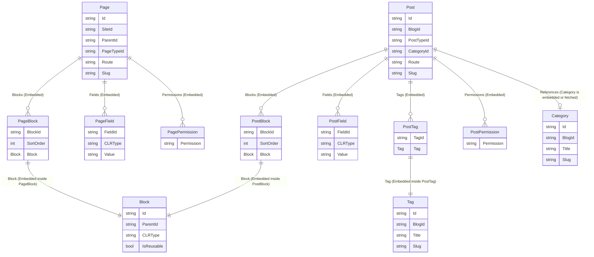

# Piranha RavenDB Data Models Overview

With the new Piranha RavenDB modeling structure, data is highly denormalized to optimize for single-document fetches. Aggregate roots like [Post](file:///c:/Users/bbqch/proj/microbians/piranha/data/Piranha.Data.RavenDb/Data/Post.cs#13-101) and [Page](file:///c:/Users/bbqch/proj/microbians/piranha/data/Piranha.Data.RavenDb/Data/Page.cs#13-119) embed their sub-entities directly instead of relying on foreign-key joins.

## Embedding vs Standalone Collections

1. **Embedded Sub-entities**: [Block](file:///c:/Users/bbqch/proj/microbians/piranha/data/Piranha.Data.RavenDb/Data/PageBlock.cs#18-53), [PostTag](file:///c:/Users/bbqch/proj/microbians/piranha/data/Piranha.Data.RavenDb/Data/PostTag.cs#15-39), [PageField](file:///c:/Users/bbqch/proj/microbians/piranha/data/Piranha.Data.RavenDb/Data/PageField.cs#15-29), `PostField`, `PagePermission`, and `PostPermission` are stored entirely within the [Post](file:///c:/Users/bbqch/proj/microbians/piranha/data/Piranha.Data.RavenDb/Data/Post.cs#13-101) or [Page](file:///c:/Users/bbqch/proj/microbians/piranha/data/Piranha.Data.RavenDb/Data/Page.cs#13-119) JSON documents. They are not queryable directly as separate collections.
2. **Standalone Tracking Documents**: While tags and categories are embedded (or referenced) inside the [Post](file:///c:/Users/bbqch/proj/microbians/piranha/data/Piranha.Data.RavenDb/Data/Post.cs#13-101) document for fast loading, there are still standalone [Tag](file:///c:/Users/bbqch/proj/microbians/piranha/data/Piranha.Data.RavenDb/Data/Tag.cs#15-30) and [Category](file:///c:/Users/bbqch/proj/microbians/piranha/data/Piranha.Data.RavenDb/Data/Category.cs#15-30) collections (`session.Query<Tag>()` and `session.Query<Category>()`). These standalone collections are maintained to track all globally available taxonomy terms for UI/lookup purposes. 

## Entity Relationship Diagram (ERD)

Here is a visual representation of how [Page](file:///c:/Users/bbqch/proj/microbians/piranha/data/Piranha.Data.RavenDb/Data/Page.cs#13-119) and [Post](file:///c:/Users/bbqch/proj/microbians/piranha/data/Piranha.Data.RavenDb/Data/Post.cs#13-101) encapsulate their related objects:

### Key Changes
- When you load a [Post](file:///c:/Users/bbqch/proj/microbians/piranha/data/Piranha.Data.RavenDb/Data/Post.cs#13-101) via `session.LoadAsync<Post>(id)`, **all** of its Blocks, Tags, Fields, and Permissions are fetched in that single request.
- Deleting a [Post](file:///c:/Users/bbqch/proj/microbians/piranha/data/Piranha.Data.RavenDb/Data/Post.cs#13-101) automatically deletes its local embedded [Block](file:///c:/Users/bbqch/proj/microbians/piranha/data/Piranha.Data.RavenDb/Data/PageBlock.cs#18-53) instances. We no longer explicitly call `session.Delete(block)` for an embedded block.
- Piranha still mirrors taxonomy items into global Standalone Collections (like [Category](file:///c:/Users/bbqch/proj/microbians/piranha/data/Piranha.Data.RavenDb/Data/Category.cs#15-30) and [Tag](file:///c:/Users/bbqch/proj/microbians/piranha/data/Piranha.Data.RavenDb/Data/Tag.cs#15-30)) when saving a [Post](file:///c:/Users/bbqch/proj/microbians/piranha/data/Piranha.Data.RavenDb/Data/Post.cs#13-101) so that we can query "What are all the tags available in this blog?". Cleanup processes (like [DeleteUnusedTags](file:///c:/Users/bbqch/proj/microbians/piranha/data/Piranha.Data.RavenDb/Repositories/PostRepository.cs#1085-1144)) prune these global trackers when they are no longer embedded in any published or drafted posts.
