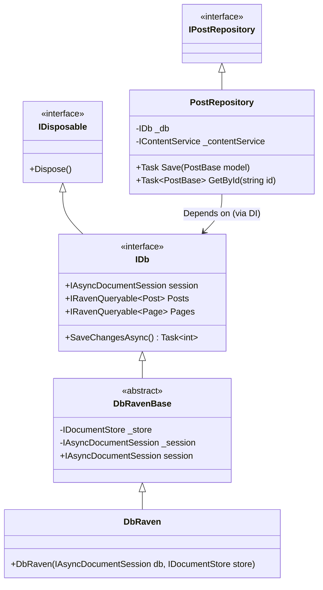
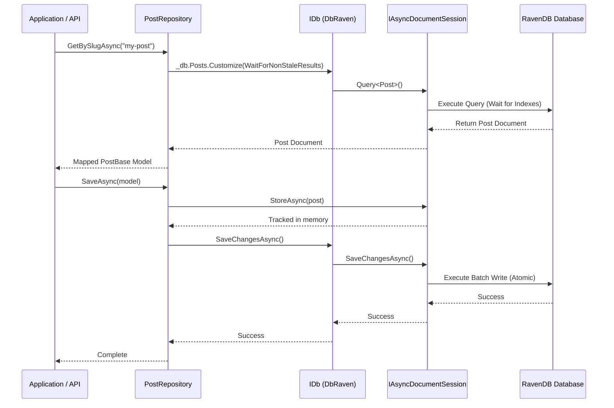
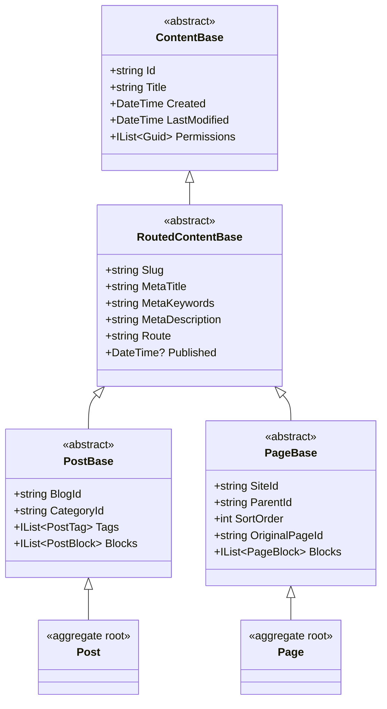

# Piranha CMS - RavenDB Architecture & Flow

This document outlines the architecture, control flow, and entity model inheritance for the RavenDB provider in Piranha CMS. It details how the core `IDb` interface manages the document session, how Repositories interact with the database, and the inheritance chains of the core document models.

## 1. Database Access and Control Flow

The RavenDB provider abstracts database access through the `IDb` interface. This interface exposes both the core RavenDB `IAsyncDocumentSession` (for raw document tracking, embedded storage, and unit-of-work) as well as queryable collections for root aggregate documents.

### Class Structure: IDb and Repositories

### Control Flow: Loading and Saving Data

Repositories rely on `IDb` to access the database.
- **Writes & Direct Reads**: Repositories use `_db.session.LoadAsync<T>()` and `_db.session.StoreAsync()` to directly interact with document IDs. This bypasses RavenDB's indexing engine, avoiding eventual consistency issues and guaranteeing immediate read-after-write accuracy.
- **Queries**: When querying by fields (like Slug or Date), repositories use `_db.Posts` (which maps to `_db.session.Query<T>()`). To handle RavenDB's eventual consistency, queries apply `.Customize(x => x.WaitForNonStaleResults())` to ensure the index is fully up-to-date before returning data.
- **Unit of Work**: The repository operations update the session state. Actual writes to the database are flushed simultaneously when `_db.SaveChangesAsync()` is called.

## 2. Entity Model Inheritance Chain

Piranha's underlying data entities utilize an inheritance hierarchy. This allows shared concerns (like routing, permissions, and basic content fields) to be handled generically by the base classes.

In RavenDB, these concrete classes (like `Post` and `Page`) serve as the **Aggregate Roots**. Everything that conceptually "belongs" to a single post or page—such as blocks, translated fields, and tags—is embedded directly into that JSON document, avoiding relational joins.

### Inheritance Diagram

### Explanation of the Inheritance Chain

1. **`ContentBase`**: The fundamental base class. It provides the standard `Id`, naming framework, auditing timestamps (`Created`, `LastModified`), and document-level permission arrays.
2. **`RoutedContentBase`**: Inherits from `ContentBase`. It adds properties required for web routing and SEO. Any content that requires a direct URL (like pages and posts) inherits from this. It handles `Slug`, `Meta...` tags, and the `Published` timestamp.
3. **`PostBase` / `PageBase`**: These branch off from `RoutedContentBase` to introduce domain-specific properties. 
    - `PostBase` manages the relationship linking a post to its parent blog (`BlogId`), taxonomy classifications (`CategoryId` and embedded `PostTag` lists), and embedded content blocks (`PostBlock`).
    - `PageBase` manages hierarchical structure (`ParentId`, `SortOrder`), copying references (`OriginalPageId`), and its own embedded content blocks (`PageBlock`).
4. **`Post` / `Page`**: The concrete aggregate root classes that get serialized directly into the RavenDB collections (`_db.Posts` and `_db.Pages`). In the JSON map, these documents store the full inheritance chain's properties at the root level alongside their embedded lists of blocks and tags.
